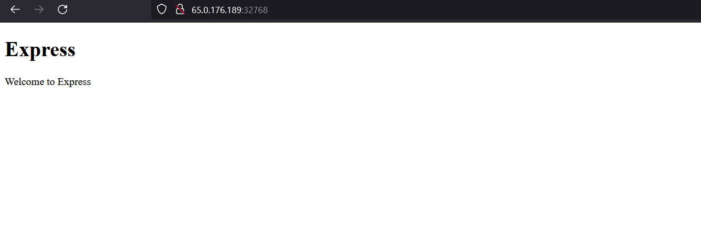

# To create a jenkins master and node and build a nodejs :
-----
*  create 2 vm's jenkins master and node .
*  Install java-11 and jenkins on jenkins master vm.
*  After installing the jenkins in master configure the jenkins master,by logging into the jenkins master on web and installing the required softwares.
*  Now, install java-11,nodejs,npm on jenkins node and connect the node to jenkins master .
*  Connect the node to master by going into the configuration settings in the jenkins console and add the node private ip and ssh key and give the user name .
*  After the node is configured write an declarative pipeline to install and run npm .
*  execute the build and observe the console output on the web by <publicip of node : 3000>.
*  After that write a Dockerfile for the same and build an image and run the container.
*  After the container is working, tag the image and push the image to your docker hub .
 check output
* output :
